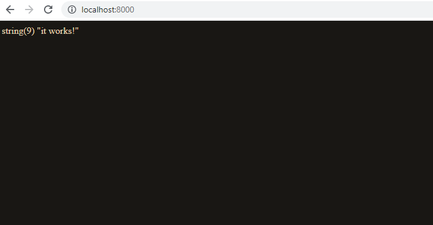

# Install composer

Easy peezy just go to https://getcomposer.org/download/ and install Composer


Change in php.ini file

;extension_dir = "\xampp\php\ext"

extension_dir = "c:/xampp/php/ext"

Go to the folder you want to install symfony and tape

`composer create-project symfony/website-skeleton`


Now tape 

`php -S 127.0.0.1:8000 -t public`


Symfony 5 actuellement donc cours à suivre https://www.youtube.com/watch?v=4t3fNkGwRWo


now add these lines to routes.yaml

```
index:
   path: /
   controller: App\Controller\DefaultController::index
```

then create the file DefaultController.php in src/controllers

```
<?php

namespace App\Controller;

class DefaultController
{
    public function index()
    {
        var_dump("it works!");
        die();
    }
}
```



Now edit the DefaultController

```
<?php

namespace App\Controller;

use Symfony\Bundle\FrameworkBundle\Controller\AbstractController;

class DefaultController extends AbstractController
{
    public function index()
    {
        return $this->render('index.html.twig');
    }

    public function test()
    {
        var_dump("it works!");
        die();
    }
}
```

and add a file in template directory called `index.html.twig` and copy past what is in `base.html.twig`

that's what it renders

As I work on windows now you can download symfony.exe and pu it at the root of the project

https://symfony.com/download
