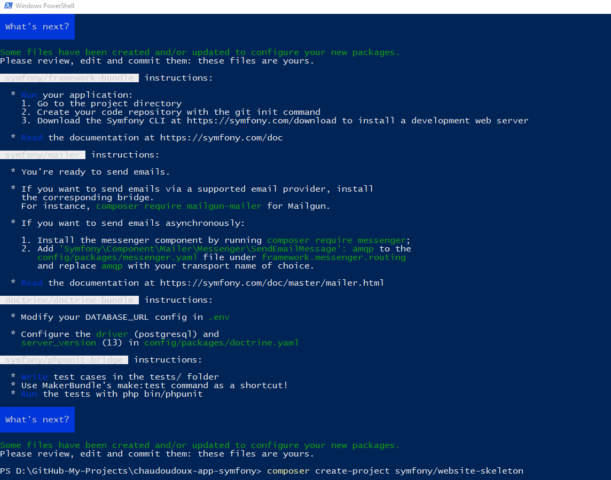

# Install composer

Easy peezy just go to https://getcomposer.org/download/ and install Composer

Change in php.ini file

;extension_dir = "\xampp\php\ext"

extension_dir = "c:/xampp/php/ext"

Go to the folder you want to install symfony and tape

`composer create-project symfony/website-skeleton`

